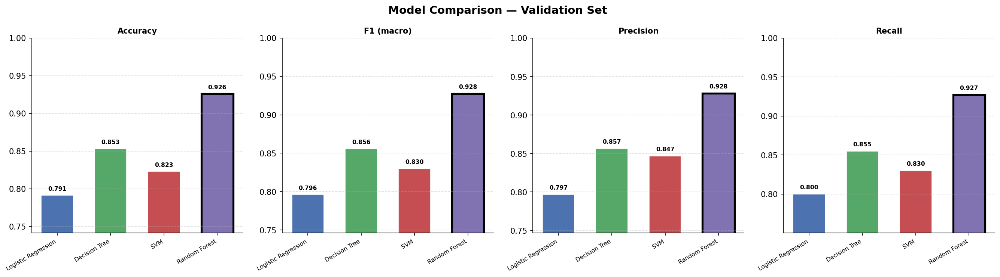

```
## Hand Gesture Recognition — Research Branch

### Model Choice: Random Forest

Random Forest was selected because it achieved the highest accuracy (~93%)
and F1-macro score across all four models, with no hyperparameter tuning —
leaving room for future improvement.

### Model Comparison

| Model               | Accuracy | F1 (macro) | Precision | Recall |
|---------------------|----------|------------|-----------|--------|
| Logistic Regression | ~0.XX    | ~0.XX      | ~0.XX     | ~0.XX  |
| Decision Tree       | ~0.XX    | ~0.XX      | ~0.XX     | ~0.XX  |
| SVM (RBF)           | ~0.XX    | ~0.XX      | ~0.XX     | ~0.XX  |
| **Random Forest** ✅ | **~0.93**| **~0.93**  | **~0.93** | **~0.93**|

*(Fill in exact values from Cell 16 output)*



### MLflow Registry
Model registered as: `hagrid-gesture-classifier`

### Screenshots
See the `screenshots/` folder for MLflow UI captures.
```
